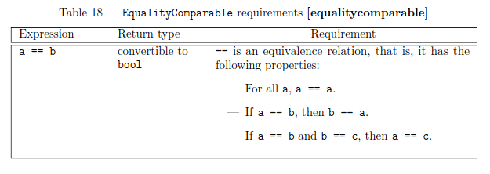

#TODO
old style
emulation
concepts

crtp
http://publications.lib.chalmers.se/records/fulltext/local_124669.pdf
Generic programming with C++ concepts and
Haskell type classes—a comparison

history -> bjarne started 25 years ago


---

## Concepts and C++20 draft

http://eel.is/c++draft/temp.constr


---

<!-- footer:  kris@jusiak.net | @krisjusiak | linkedin.com/in/kris-jusiak -->

Meeting C++ 2017

# Concepts Driven Design

<hr />

##### Kris Jusiak, Quantlab


---

<!-- story how concepts were removed from C++0x  -->

<!-- footer: Meeting C++ 2017 | Concepts Driven Design | Kris Jusiak -->

# Concepts - Agenda

* Why we want/need them?
* What we didn't get (breifly)
* What we got (most likeley)
  * requires-clause
  * named concepts
* What can we do with it
  * design by introspection
  * optional interfaces
  * depedency injection
* Can we live without it?
  * concepts emulation in C++17?
* What the feature may bring?
  * virtual concepts

---

### C++ Concepts vs Haskell typeclasses

```cpp
concept Eq<typename T> {
    bool operator==(T, T);
}
```

```haskell
class Eq a where
  (==) :: a -> a -> Bool
```

---

## Disclaimer

All presented examples compiles with GCC-trunk (7.2).

> `g++ -std=c++2a -fconcepts`

C++20 is still open for alterations.

---

<!-- page_number: true -->

## Concepts - History

> From Frankfurt 2009 to Toronto 2017


---

## Summer ISO C++ Meeting in Toronto, Canada (July 10th - 15th 2017)

<center>
  


Concepts TS was merged into draft C++20! https://wg21.link/P0734R0

</center>

---
 
## Requirements in the ISO C++ standard
<center>
  


</center>

```
template<class T>
concept EqualityComparable = requires(T a, T b) {
  { a == b } -> bool;
};
```

---

Placeholders

vector<auto>


---

## Concepts - Real life example - Ranges TS

```cpp
template <class I>
concept InputIterator =
  Iterator<I> &&
  Readable<I> &&
  requires(I& i, const I& ci) {
      typename iterator_category_t<I>;
      DerivedFrom<
        iterator_category_t<I>, input_iterator_tag>;
      i++;
  };
```

https://github.com/CaseyCarter/cmcstl2

---

What you can't do with concepts

std::vector<Any> v;
  
v.push_back("Meeting C++");
v.push_back(2017);

---

## [Virtual concepts](https://github.com/andyprowl/virtual-concepts/blob/master/draft/Dynamic%20Generic%20Programming%20with%20Virtual%20Concepts.pdf)

```cpp
template<class T>
concept EqualityComparable = requires(T a, T b) {
  // standard
  { a == b } -> bool;
};
```

```cpp
template<class T>
concept EqualityComparable = requires() {
  // NOT standard!
  auto operator==(const T&, const T&) -> bool;
};
```

---

type erasure

```cpp
template<typename T>
concept Any = requires(T x) {
  requires DefaultConstructible<T> &&
    CopyConstructible<T> &&
    NoThrowMoveConstructible<T> &&
    CopyAssignable<T> &&
    NoThrowMoveAssignable<T> &&
    Destructible<T>;
};
```

```cpp
concept Fooable
```

```cpp
std::vector<virtual Any> v;
v.push_back("Hello"s);
v.push_back(42);
```

---

Shape

draw(virtual Shape);

---

## Syntax

* 1/5

```cpp
template<class T> requires CONCEPT;
void foo(T);
```

* 2/5

```cpp
template<CONCEPT T>
void foo(T);
```

* 3/5

```cpp
void foo(CONCEPT);
```

```cpp
{CONCEPT} void foo(CONCEPT);
```

But

```cpp
template<auto X> // ERROR
```


terse template notation

3/5

---

## Does the Concepts TS Improve on C++17?

https://wg21.link/P0726R0

```cpp
template <class F, class... Args, class =  decltype(
  std::declval<F&&>()(std::declval<Args&&>()...))>
constexpr auto requires_impl(int) { return true; }

template <class F, class... Args>
constexpr auto requires_impl(...) { return false; }

template <class... Args, class F>
constexpr auto requires(F&&) {
  return requires_impl<F&&, Args&&...>(int{});
}
```

---

Concepts emulation

---

##  Substituation Failure Is Not An Error (SFINAE)

```cpp
template<bool, class = void>
struct enable_if {};
 
template<class T>
struct enable_if<true, T> { using type = T; };
```

* `false` predicates lead to ill-formed code that's discarded

---

## Requires-clause

```cpp
void foo() requires false;
```

---

```cpp
constexpr auto endian = endian::native;
```

```cpp
void foo(std::string_view) // same argument list
  requires endian = endian::big;
  
void foo(std::string_view) // same argument list
  requires endian = endian::little;

void foo(std::string_view) // same argument list
  requires endian = endian::native;
```

* requires-clause is part of the signature

---

## Design by introspection - Andrei Alexandrescu


[](https://www.youtube.com/watch?v=29h6jGtZD-U)

---

D lang

```cpp
__compiles // __traits

__traits(compiles)

if constexpr(requires (T t) { t.foo(); }) {
}
```

---

optional interfaces

decorators

---

## Error Novel

---

## Requires clause

---

## Named Concepts

A collection of requirements on a type

> "If you like it then you should have put a name on it", Beyonce rule

```cpp
template<class T>
concept Fooable =           // named concept
  requires(T t) {           // collection of
    typename T::type;       // requirement
    { t.foo() } -> void;    // requirement
    requires Movable<T>;    // requirement
  };
```


---

## Concepts - By Example

[Everything Cpp - C++ Concepts](https://www.youtube.com/watch?v=xsSYPD0v5Mg)

```cpp
struct tcp_socket { void send(std::string_view); };
struct udp_socket { void send(std::string_view); };
```

---

## Concepts - By Example - Naive

```cpp
template<class T>
void forward(T& socket, std::string_view data) {
  if (data) {
    socket.send(data);
  }
}
```

```cpp
int main() {
  tcp_socket tcp{}; forward(tcp, "tcp data");
  udp_socket udp{}; forward(udp, "udp data");
}
```

---

## Concepts - By Example - Problem

```cpp
struct file { void write(std::string_view); };
```

```cpp
int main() {
  file f{}; 
  forward(f, "file data"); // Compile ERROR
                           // file has no member 'send'
}
```

* Notes
  > Error Novel
  > leaks to the library code
  > it might be deep in in the intstanitaion 

---

## Concepts - By Example  - SFINAE

SFINAE + enable_if

has_send

---

## Concepts - By Example - Requires

```cpp
template<class TSocket>
  // YES, requires requires!
  requires requires(T socket, std::string_view data) { 
    socket.send(data); 
  }
void forward(T& socket, std::string_view data) {
  socket.send(data);
}
```

```cpp
int main() {
  file f{}; 
  forward(f, "file data"); // Compile ERROR
                           // constraint is not satisfied
                           // t.send
}
```

* Notes
  * imaginary Socket may not be copyable
  * a requires-claused followed by a requires expression
  * Note, noexcept(noexcept)

---

## Concepts - By Example - Overloading

```cpp
template<class TSocket>
  requires requires(T socket, std::string_view data) { 
    socket.write(data); 
  }
void forward(T& socket, std::string_view data) {
  socket.write(data);
}
```

---

## Concepts - By Example - Named concepts

```cpp
template<class TSocket> concept Socket = 
  requires(TSocket socket, std:string_view data) {
    { t.send(data); } -> void;
};
```

Notes
* varaible template
* no bool required as in the previous designs
* no function

---

syntax concept id in the template parameter list
instead of class/typename -> concept
template<Socket>
  
terse/natural syntax

not part of the standard
forward(Socket&);
* Socket -> placeholder -> tempplate<class T> requires Socket
  
auto is a different placehoder -> weakest concept

however

template<auto> is something else

Notes:
	* forward(auto, auto);
	* forward(Socket, Socket);

the same concepts requires the same types!!!
but it's not true for auto, auto

---

lambda
lambda plush <T>
concepts emulation


```cpp
constexpr auto expr = [] {
  if constexpr(requires(T t) { t.foo(); }) {
    return t.foo();
  }
};
```

FIle/Socket

[Everything Cpp - C++ Concepts](https://www.youtube.com/watch?v=xsSYPD0v5Mg)

---

## Concepts - Requirements

```cpp
template<class T> concept Fooable = requires(T) {
  typename T::value_type; // type requirement
};
```

```cpp
template<class T> concept Fooable = requires(T t) {
  t[typename T::value_type{}]; // simple requirement
};
```

```cpp
template<class T> concept Fooable = requires(T t) {
  { t.empty() } -> bool; // compound requirement
};
```

```cpp
template<class T> concept Fooable = requires(T t) {
  requires std::is_integral_v<typename T::value_type>;
};
```

---


```cpp
template<class T>
concept Fooable = requires(T t) {
};
```

---

## Concepts

```cpp
auto fooable = Foo{}; // wekeast concept
```

# TODO template class constructor deduction

std::vector<int> v = {1, 2, 3};
auto v = make_vector(1, 2, 3); // auto - weakest concept
std::vector v = {1, 2, 3}; // C++17
Container v = {1, 2, 3}; // Concepts
  

```cpp
Fooable fooable = Foo{};
```

```cpp
Pointer fooable = Foo{};
```

---

## Concepts

```cpp
template<class T>
```

```cpp
template<Fooable T>
```

```cpp
template<auto T> // Error!
```

---

```cpp
void foo() requires requires(T t) { t.foo(); } 
```


lambda syntax []<class T>
vector<auto> placeholders

---

## Concepts and Metaclasses - https://wg21.link/p0707r0

```cpp
template<class T>
Fooable Foo { };  // static_assert(Fooable<Foo>);
```

---

type erasure with mocking
mocking

---

## Concepts driven design - Goals / Dream

| | |
|-|-|
| Expressiveness | Type constraints for better error messages (Design by Introspection) |
| Loosely coupeled design | Inject all the things! (Policy Design) |
| Performance | Static dispatch by default <br />(based on concepts) |
| Flexiblity | Dynamic dispatch using type erasure (based on the same concepts) |
| Testability | Automatic mocks injection <br />(based on the same concepts) |

---

## Type constraints - [VC](https://github.com/boost-experimental/vc)

#### Non-templated constraints (optional interfaces)

```cpp
struct Readable {               | // Readable Implementation
 template<class T>              |
  auto operator()() const {     | struct Reader { // no inheritance
    MoveConstructible<T> &&    <|> Reader(Reader&&) = default; // ✔
    MoveAssignable<T> &&       <|> Reader& operator=(Reader&&) = default; // ✔
    Callable<T, int()>($(read))<|> int read(); // ✔
  };                     ^      | };
};               ________/      |
                /               | static_assert(
  /* Lambda expression */       |  is_satisfied_by<Readable, Reader>{}
  /* exposing a read() call */  | );
```
<!-- .element: style="margin-left:0%; width:100%" -->

----

## Inject all the things! - [[Boost].DI](https://github.com/boost-experimental/vc)

#### Policy design
```cpp
template<class T = class TException> // `TException` is satisifed by any type
struct ThrowExceptionPolicy {        //  It's like auto in Concepts-lite
  void onError(std::string_view msg) { throw T{msg}; }
};
```
<!-- .element: style="margin-left:0%; width:100%" -->

```cpp
template<class TPolicy = class TErrorPolicy>
class App : TPolicy {
public:
  void run() {
    if (...) { TPolicy::onError("error!"); }
  }
};
```
<!-- .element: style="margin-left:0%; width:100%" -->

```cpp
int main() {
  const auto injector = di::make_injector(                 // wiring
   di::bind<class TException>.to<std::runtime_error>(),    // concept->type
   di::bind<class TErrorPolicy>.to<ThrowExceptionPolicy>() // concept->template
  );
  di::make<App>(injector).run(); // App is a template!
}
```
<!-- .element: style="margin-left:0%; width:100%" -->

----

## [DI](https://github.com/boost-experimental/vc) - 2-Phase resolving (concepts / ctors) 

```cpp
template<class TReader = Readable, // typename = concept
         class TPrinter = Printable>
class App {
  TReader reader;
  TPrinter printer;

public:
  App(TReader reader, TPrinter printer) // constructor
   : reader(reader), printer(printer)   // parameters deduction
  { }

  void run() { printer.print(reader.read()); }
};
```

#### Concepts based injection (compile time wiring)
```cpp
int main() {
 const auto injector = di::make_injector(
   di::bind<Readable>.to<FileReader>(),     // concept -> type
   di::bind<Printable>.to<ConsolePrinter>() // concepts checking
 );                                         // at wiring!
 di::make<App>(injector).run(); // preallocates shared dependencies
```

----

## type_erasure for dynamic dispatch - [VC](https://github.com/boost-experimental/vc)

```cpp
template<class TReader = Readable> // type = concept
class App {
  TReader reader;
  any<Printable> printer; // type erasure based on the same concept
                          // as concepts example
public:
  App(TReader reader, any<Printable> printer) // 100% value semantics
    : reader(reader), printer(printer)
  { }

  void run() { printer.print(reader.read()); }
};
```

#### Dynamic bindings using virtual concepts
```cpp
const auto config = [](std::string_view printer) {
  return di::make_injector(
    di::bind<Readable>.to<FileReader>(),
    di::bind<Printable>([&](auto&& _) {
      return printer == "QT" ?
        _.to<QtPrinter>() : _.to<ConsolePrinter>();
    })
  );
};
```

----

## Automatic / concepts based / mocks injection - [GUnit.GMock](https://github.com/cpp-testing/gunit)

```cpp
"should print read text"_test = [] {
 constexpr auto value = 42;
 auto [app, mocks] = testing::make<App>(); // creates System Under Test
                                           // and Mocks!

 InSequence sequence;
 {
   EXPECT_CALL(mocks<Readable>(), read()).WillOnce(Return(value));
   EXPECT_CALL(mocks<Printable>(), print(value));
 }

 app.run();
};
```
#### It works with concepts/type_erasure and interfaces!


---

## Injecting named concepts - Concepts base design

```cpp
template<class TFoo = Fooable, class TBar = Barable>
class Example { 
public:
  constexpr Example(TFoo, TBar);
};
```

[Boost].DI
```cpp
constexpr auto injector = di::make_injector(
  di::bind<Fooable>.to<Foo>(),
  di::bind<Barable>.to<Bar>()
);
```

```cpp
auto example = injector.create<Example>();
```

---

<!-- page_number: false -->

## Summary

* Simplify enable_if
* can be emulated in C++14

---

```cpp
template <class T>
concept Readable =
  CopyConstructible<T> and
  CopyAssignable<T> and
  requires(T t) {
    { t.read() -> int }
  }
};
```

```cpp
template <class T>
constexpr auto Readable =
  CopyConstructible<T> and
  CopyAssignable<T> and
  Callable<T, int()>($(read)); // expose read for mocking!
```

---

```cpp
Callable<T, int()>($(read)) --> Constraint
          \_  \_____   \___-> name
            \       \
$(name) [](auto t, auto r, auto... args) { // expression
 struct { // inherit from
  auto name(decltype(args)... args) 
    -> decltype(self.name(args...)) { 
   // static polymorphism
   return static_cast<decltype(t) *>(this)
     -> template call_<name, decltype(r)>(args...);
  }
 } _; return _; // local struct
}
```

---

```cpp
template<class... TConstraints>
class gmock_impl : decltype(std::declval<TConstraints::expression>()(
                             TConstraints::args...))... (
public:
 gmock_impl() = default;

 template <class TName, class R, class... TArgs>
 decltype(auto) call_(TArgs &&... args); // calls mocked impl...
};
```

---


## Questions?

|         |  |
| - | - |
| **Concepts**    | https://wg21.link/P0734R0  | 
| **Virtual Concepts**    |  https://github.com/andyprowl/virtual-concepts/blob/master/draft/Dynamic%20Generic%20Programming%20with%20Virtual%20Concepts.pdf | 
| **Metaclasses**    | https://wg21.link/p0707r0  | 
| **[Boost].DI**  | https://github.com/boost-experimental/di  |

<!-- footer:  kris@jusiak.net | @krisjusiak | linkedin.com/in/kris-jusiak -->